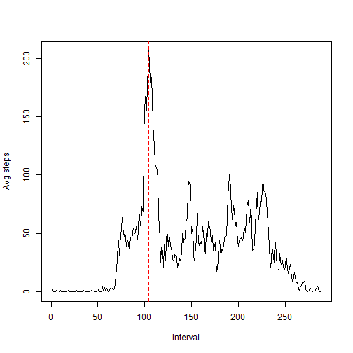

##Part 1: "Loading and preprocessing the data"
Replace the path below with your working directory and make sure the dataset file is placed in that directory.


```r
setwd("c:/users/lekkakis/desktop/datascience/reproducible research/assignment 1")
activity<-read.csv("activity.csv")
```

##Part 2: "What is mean total number of steps taken per day?"


```r
Q1<-aggregate(activity$steps,list(activity$date),sum,na.rm=TRUE)
names(Q1)<-c("date","Total.steps")
hist(Q1$Total.steps,breaks=seq(min(Q1$Total.steps),max(Q1$Total.steps),length.out=8),xlim=c(0,max(Q1$Total.steps)),xaxt="n",xlab="",ylab="No. of Days",main="Total steps taken per day")
axis(side=1, at=round(seq(min(Q1$Total.steps),max(Q1$Total.steps),length.out=8)),las=2)
mean.steps<-mean(Q1$Total.steps)
median.steps<-median(Q1$Total.steps)
abline(v=mean.steps,col="blue",lty=2)
abline(v=median.steps,col="red",lty=2)
text(mean.steps,15,"Mean",srt=90)
text(median.steps,15,"Median",srt=90)
```

 

- The mean of the total number of steps taken per day is 9354.2295082
- The median of the total number of steps taken per day is 10395

##Part 3: "What is the average daily activity pattern?"


```r
Q2<-aggregate(activity$steps,list(activity$interval),mean,na.rm=T)
names(Q2)<-c("Interval","Avg.steps")
Q2$Interval<-1:nrow(Q2)
plot(Q2,type="l")
interval.max.avg.steps<-which(Q2$Avg.steps==max(Q2$Avg.steps))
abline(v=interval.max.avg.steps,col="red",lty=2)
```

 

- The maximum number of steps resides within the 104th interval.


##Part 4: "Inputing missing values" 
Note that I used the mean for each particular interval to fill in the missing values.


```r
Tot.NA<-sum(is.na(activity$steps))
na.indices<-which(is.na(activity$steps))
na.intervals<-activity$interval[na.indices]
temp.Q4<-aggregate(activity$steps,list(activity$interval),mean,na.rm=T)
names(temp.Q4)<-c("Interval","Avg.steps")
repl.values<-temp.Q4$Avg.steps[match(na.intervals,temp.Q4$Interval)]
Q4<-activity
Q4$steps[na.indices]<-repl.values
Q4b<-aggregate(Q4$steps,list(Q4$date),sum,na.rm=TRUE)
names(Q4b)<-c("date","Total.steps")
hist(Q4b$Total.steps,breaks=seq(min(Q4b$Total.steps),max(Q4b$Total.steps),length.out=8),xlim=c(0,max(Q4b$Total.steps)),xaxt="n",xlab="",ylab="No. of Days",main="Total steps taken per day")
axis(side=1, at=round(seq(min(Q4b$Total.steps),max(Q4b$Total.steps),length.out=8)),las=2)
mean.steps4<-mean(Q4b$Total.steps)
median.steps4<-median(Q4b$Total.steps)
abline(v=mean.steps4,col="blue",lty=2)
abline(v=median.steps4,col="red",lty=2)
text(mean.steps4,10,"Mean",srt=90)
text(median.steps4,16,"Median",srt=90)
```

 

- The mean of the new dataset is 1.0766189 &times; 10<sup>4</sup>
- The median of the new dataset is 1.0766189 &times; 10<sup>4</sup>


##Part 5: "Are there differences in activity patterns between weekdays and weekends?" 
Note that I am loading the "lattice" graphics package to facilitate on my plotting.


```r
Q5<-Q4
Q5$date<-gsub("monday|tuesday|wednesday|thursday|friday","weekday",weekdays(as.Date(Q5$date)),ignore.case = T)
Q5$date<-gsub("saturday|sunday","weekend",Q5$date,ignore.case = T)
Q5$date<-as.factor(Q5$date)
Q5b<-aggregate(Q5$steps,list(Q5$interval,Q5$date),mean)
names(Q5b)<-c("Interval","Date", "Avg.steps")
Q5b$Interval<-1:nrow(Q2)
library(lattice)
xyplot(Q5b$Avg.steps~Q5b$Interval|Q5b$Date,type="l",layout=c(1,2),xlab="Interval",ylab="Avg. Steps")
```

 

As can be observed in the above plots, the weekends appear to have a more widespread distribution in the number of steps taken during the day (8am to 8pm), as opposed to the weekdays, during which the number of steps peak between the 100th and 120th interval (8am-9:30am).
